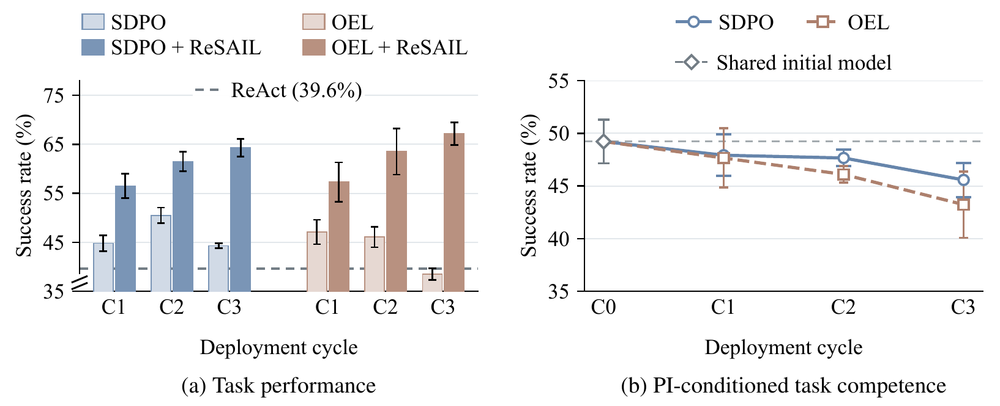
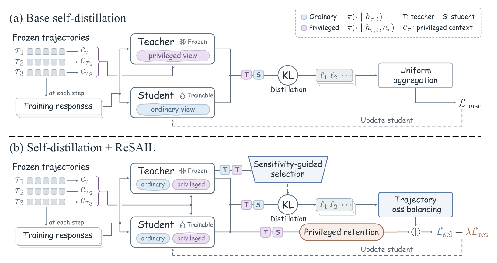

<!-- Modified for ReSAIL. See NOTICE and LICENSE for attribution and terms. -->

<h1 align="center">
  
  ReSAIL: Mitigating Collapse in Iterative<br>
  Agent Self-Distillation
</h1>

<p align="center">
  <a href="https://huggingface.co/collections/HuggingJin/resail-6ab8e06426ca99d03aabfa0f" title="Public model collection">
    
  </a>
  <a href="https://arxiv.org/abs/2609.39306">
    
  </a>
  <a href="docs/environment.md">
    
  </a>
  <a href="LICENSE">
    
  </a>
</p>

<p align="center">
  <a href="#news">News</a> ·
  <a href="#motivation">Motivation</a> ·
  <a href="#overview">Overview</a> ·
  <a href="#quick-start">Quick Start</a>
</p>

---

**ReSAIL** (**Retentive and Selective Augmentation for Iterative Self-Distillation**) mitigates performance collapse in iterative agent self-distillation. It is a plug-in augmentation that combines **trajectory-balanced selective distillation** with **privileged retention** to improve learning within each cycle and preserve behavior conditioned on privileged information (PI) as the student becomes the next teacher.

On **ALFWorld** and **TextCraft**, ReSAIL sustains substantial gains with **Qwen3-4B and Qwen3-8B** over **three deployment cycles**. Adding ReSAIL to the corresponding **SDPO and OEL** baselines improves final-cycle success rates by an **average of 22.5 percentage points**.

> Our findings provide the **first evidence** that a more robust learning mechanism can effectively **mitigate performance collapse** in iterative agent self-distillation over deployment trajectories.

<a name="news"></a>

## News

- **[2026.10]** We release the code for **ReSAIL**, built on [slime](https://github.com/THUDM/slime), with training and evaluation scripts included.
- **[2026.09]** Eight Cycle-3 checkpoints for **ALFWorld** and **TextCraft**, with **Qwen3-4B and Qwen3-8B**, are now public in the [ReSAIL Collection](https://huggingface.co/collections/HuggingJin/resail-6ab8e06426ca99d03aabfa0f).
- **[2026.09]** Our paper is available on [arXiv](https://arxiv.org/abs/2609.39306).

<a name="motivation"></a>

## Motivation

Iterative self-distillation lets agents learn from successive deployments, offering a path toward **recursive self-improvement (RSI)**. Yet repeating the learning cycle does not guarantee continued improvement: our experiments with SDPO and OEL reveal **collapse in deployment performance** alongside **declining task competence with privileged information (PI)**.

PI is extra context available during training and omitted during deployment. Each updated model must both act without PI and provide PI-conditioned supervision as the next teacher. The base distillation objective trains the student only without PI, leaving its PI-conditioned behavior without an explicit preservation objective.

<p align="center">
  
</p>
<p align="center"><em>Figure 1. ALFWorld OOD with Qwen3-4B. (a) Deployment success with and without ReSAIL. (b) PI-conditioned success of the original methods, with tasks and PI held fixed across cycles. C0 is the shared initial model; error bars show standard deviation across three decoding seeds.</em></p>

This motivates two questions:

1. **Which interaction steps should be prioritized for distillation?** We prioritize steps where PI most strongly changes the teacher's predictions, measuring this PI sensitivity using Jensen–Shannon divergence between teacher predictions with and without PI.
2. **What happens when the student becomes the next teacher?** Preserving the student's PI-conditioned behavior maintains the supervision used in the next cycle.

<a name="overview"></a>

## Overview

ReSAIL addresses these questions with two complementary modules: **Trajectory-Balanced Selective Distillation (TBSD)** for learning within each cycle, and **Privileged Retention (PR)** for retaining PI-conditioned behavior across cycles.

<p align="center">
  
</p>
<p align="center"><em>Figure 2 from the paper. ReSAIL adds selective distillation and privileged retention to the base self-distillation loop.</em></p>

| Component | Role |
| --- | --- |
| **[Sensitivity-Guided Selection (SGS)](slime_plugins/agent_tasks/common/algorithms/sgs.py)** | Select steps where privileged context most changes the frozen teacher's predictions. |
| **[Trajectory Loss Balancing (TLB)](slime_plugins/agent_tasks/common/algorithms/tlb.py)** | Balance the selected distillation losses across source trajectories. |
| **[Privileged Retention (PR)](slime_plugins/agent_tasks/common/algorithms/pr.py)** | Retain the teacher's privileged-view behavior on both selected and unselected steps. |

SGS and TLB together form **TBSD**. **PR** regularizes the student's PI-conditioned output distributions toward those of the frozen teacher at both selected and unselected steps. See the [method guide](docs/method.md) for the loss, sampling, and implementation details.

<a name="supported-experiments"></a>

### Supported experiments

| | Included |
| --- | --- |
| **Tasks** | ALFWorld · TextCraft |
| **Base models** | Qwen3-4B · Qwen3-8B |
| **ReSAIL integrations** | OEL + ReSAIL (`resail`) · SDPO + ReSAIL (`sdpo_resail`) |
| **Baselines** | ReAct · RFT · GRPO · EPD · SDPO · OEL |
| **Training** | Three cycles, with final-checkpoint evaluation after each cycle |
| **Shared inputs** | Collect C1 once per task and base model; reuse it across methods |

ReAct evaluates the base model once. The other methods train over C1–C3. All combinations and command options are listed in the [experiment catalog](docs/experiment_catalog.md).

<a name="quick-start"></a>

## Quick Start

<a name="1-prepare-the-environment-and-inputs"></a>

### 1. Prepare the environment and inputs

Follow the [environment guide](docs/environment.md) to build the container and prepare a matching base checkpoint. Then download the [models and task data](docs/inputs.md):

- [ALFWorld setup](slime_plugins/agent_tasks/alfworld/README.md)
- [TextCraft setup](slime_plugins/agent_tasks/textcraft/README.md)

The main configurations use **8 GPUs**. Run the commands below from the repository root on the **host**; the launcher executes the workload inside the prepared container.

Experiment logging is offline by default and requires no W&B account.

<a name="2-run-a-main-experiment"></a>

### 2. Run a main experiment

Train OEL + ReSAIL with Qwen3-4B on ALFWorld:

```bash
bash scripts/launch_experiment.sh alfworld-4b-resail-001 -- \
  bash scripts/experiments/text_cycles.sh \
    --task alfworld --model 4b --method resail --mode paper
```

This command collects fresh C1 trajectories, then completes training and evaluation for all three cycles. Change `--task`, `--model`, and `--method` to select another experiment. Each later cycle collects data using that method's preceding checkpoint.

<a name="3-share-c1-when-comparing-methods"></a>

### 3. Share C1 when comparing methods

Prepare one corpus and its guidance:

```bash
bash scripts/launch_experiment.sh alfworld-4b-shared-c1 -- \
  bash scripts/prepare/text_c1.sh --task alfworld --model 4b \
    --c1-input /workspace/slime/data/paper/shared/alfworld/4b/c1
```

Then reuse that input for OEL and OEL + ReSAIL:

```bash
for method in oel resail; do
  bash scripts/launch_experiment.sh "alfworld-4b-${method}-shared-001" -- \
    bash scripts/experiments/text_cycles.sh \
      --task alfworld --model 4b --method "$method" --mode paper \
      --c1-input /workspace/slime/data/paper/shared/alfworld/4b/c1
done
```

Shared C1 contains **960 ALFWorld** or **240 TextCraft** trajectories. Each method reads the same input and keeps its own training outputs; C2 and C3 remain separate for each method. See the [reproduction guide](docs/reproduction.md) for other combinations and output locations.

<a name="acknowledgements"></a>

## Acknowledgements

ReSAIL is built on [Slime](https://github.com/THUDM/slime). We thank the Slime contributors for their infrastructure, [Megatron-LM](https://github.com/NVIDIA/Megatron-LM) for distributed training, and [SGLang](https://github.com/sgl-project/sglang) for efficient inference.

We also thank the [ALFWorld](https://github.com/alfworld/alfworld) and [TextCraft](https://github.com/archiki/ADaPT) teams for their environments, and [AgentGym](https://github.com/WooooDyy/AgentGym) for the TextCraft integration and task data used in this project.

The inherited code retains its [Apache 2.0 license](LICENSE) and upstream attribution.
